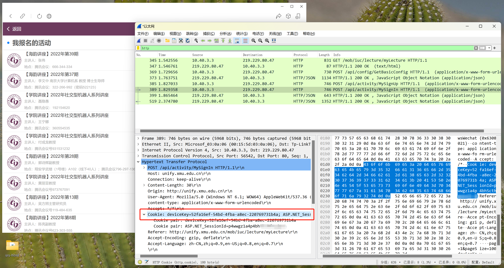
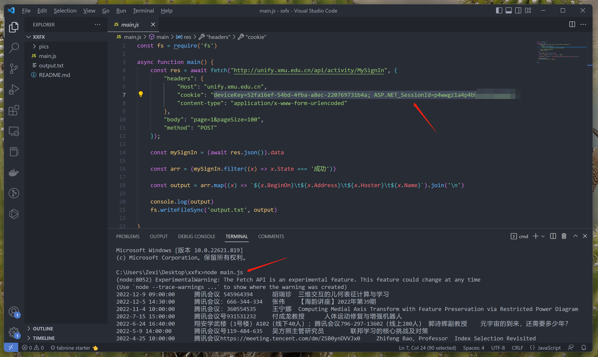

## 厦信飞翔讲座提取器

### 使用方法

1. 启动Wireshark抓包，刷新微信电脑版"厦信飞翔"讲座页面，停止抓包，过滤出http请求拿到`cookie`。

2. 把`cookie`替换到`main.js`中，并用命令`node main.js`运行，得到`output.txt`文件。

3. 复制`output.txt`内容到Excel分列，最后粘贴到Word文档中。

### 相关工具

- JavaScript脚本运行环境：[Node.js](https://nodejs.org/en/)
- 网络抓包工具：[Wireshark](https://www.wireshark.org/)
